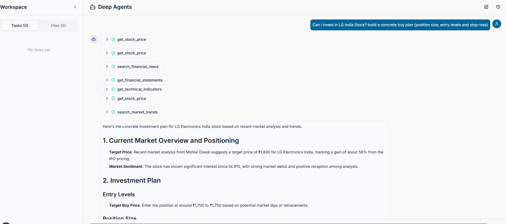
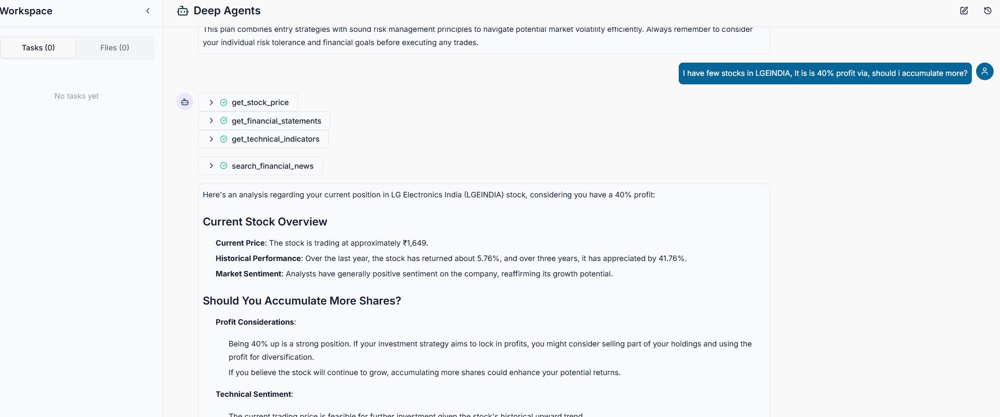

I used LangGraph deepagents, which is high level orchestrator above Langgraph State Graph. Lot of things are abstracted.

I have given an image of output.

Note: I have taken help to develop this, including prompts.

